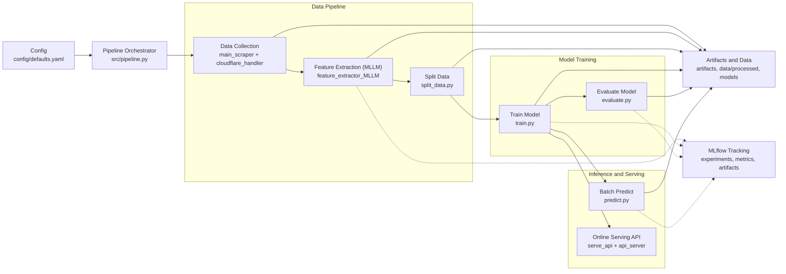

# Price Benchmark with MLLM-extracted features

### Summary:
A proof-of-concept machine learning pipeline for competitive pricing analysis - Price regression is estimated using  MLLM-extracted product features, scraped from online sources with playwright. For basic inference demo (regression component only), see the [live web app](https://mllm-product-pricing-benchmark-service.onrender.com/) deployed on Render.

*Note*: Live app is hosted on Render free tier, may take 10-30 seconds to load.

### Motivation:
Businesses often need to evaluate how their product is priced compared to similar (substitutable) products sold by their competitors. This typically takes place prior to product development but it can also be done during and after to align prices with the market. In non-technical teams this involves gathering data by visiting online competitor product listings or sometimes physically attending stores or exhibitions. Competitor products are rarely identical, thus the appropriate price cannot be determined by directly matching an existing product. Instead, price mst be estimated from how product characteristics relate to price broadly accross the market. In practise, this relationship between price and features is generally assessed informally, by comparing similar products. This project explores how feature extraction and regression modelling can partially automate this price benchmarking workflow.

### Objectives
The main objective is to:
> Develop a prototype system that provides a benchmark price prediction from product characteristics

To achieve this, there are several sub-objectives:
<ol>
<li> Program a scraper to collect product listing images </li>
<li> Use an MLLM to extract structured product features and labels using product images</li>
<li> Train a regression model to predict price from product features</li>
<li> Provide an API endpoint for inference and a demo </li>
</ol>

### Design Overview
#### Pipeline Architecture


## Reproducibility Baseline

- Install from lockfile:

```bash
pip install -r requirements.txt
```

- Editable dependency list: `requirements.in`

- Regenerate lockfile after editing `requirements.in`:

```bash
pip-compile --output-file=requirements.txt requirements.in
```

- Copy environment template once:

```powershell
copy .env.example .env
```

```bash
cp .env.example .env
```

- Shared project config: `config/defaults.yaml`
- All major scripts accept:

```bash
--config config/defaults.yaml
```

## Pipeline Order

1. Capture screenshots

```bash
python src/main_scraper.py --run-id 20260305T180000Z
```

2. Prime Cloudflare state (optional but recommended)

```bash
python src/cloudflare_handler.py --url https://www.ufurnish.com
```

3. Extract structured features from screenshots

```powershell
python src/feature_extractor_MLLM.py ^
  --screenshots-dir artifacts/scraping/20260305T180000Z/screenshots ^
  --output-jsonl data/processed/MLLM_extracted_features.jsonl ^
  --overwrite-output
```

4. Split into train/holdout

```bash
python src/split_data.py
```

5. Train

```bash
python src/train.py
```

6. Evaluate

```bash
python src/evaluate.py
```

7. Predict (batch inference)

```powershell
python src/predict.py ^
  --input data/processed/single_row_test.jsonl ^
  --output data/processed/single_test_pred.jsonl
```

## Single-Command Orchestration

- End-to-end pipeline (recommended default):

```bash
python src/pipeline.py --config config/defaults.yaml
```

- Include manual Cloudflare priming stage:

```bash
python src/pipeline.py --config config/defaults.yaml --include-cloudflare
```

- Run only part of the pipeline:

```bash
python src/pipeline.py --config config/defaults.yaml --from split --to evaluate
```

- Recreate train/holdout split safely:

```bash
python src/pipeline.py --config config/defaults.yaml --from split --to predict --force-resplit
```

- Preview commands without executing:

```bash
python src/pipeline.py --config config/defaults.yaml --dry-run
```

- Pipeline run metadata/logs are written to:
  - `artifacts/pipeline/<run_id>/run_summary.json`
  - `artifacts/pipeline/<run_id>/pipeline.log`

## Online Serving (FastAPI)

- Start API server:

```bash
python src/serve_api.py --config config/defaults.yaml
```

- Open minimal web UI: [http://127.0.0.1:8000/](http://127.0.0.1:8000/)
  - Rendered via Jinja template: `frontend/index.html`
  - Static styling: `frontend/static/styles.css`
  - UI renders one dedicated input/select per feature

- Health and readiness:
  - `GET /healthz`
  - `GET /readyz`

- Serving:
  - `GET /v1/schema`
    - Returns numeric fields (must be `> 0`), plus:
      - `categorical_fields_top`: top-K most common values per categorical field
        - K configured by `serving.top_k_categories` (default `10`)
      - `categorical_fields_all`: all allowed values observed in training metadata
        - `models/category_meta.json`
  - `POST /v1/predict`
    - Body:

```json
{
  "numeric_field": "width",
  "numeric_value": 210.0,
  "categorical_field": "colour_1",
  "categorical_value": "Grey"
}
```

    - Response includes predicted price plus model lineage identifiers
  - `POST /v1/predict_full`
    - Body:

```json
{
  "numeric_values": {"width": 210.0, "height": 95.0},
  "categorical_values": {"colour_1": "Grey", "reclining": false}
}
```

    - Used by the UI to submit all visible feature values in one request

- UI integration pattern:
  1. Call `/v1/schema` to populate dropdowns (use top values by default)
  2. Let user pick one numeric field + positive value
  3. Let user pick one categorical field + allowed value
  4. Send `POST /v1/predict`

## Deploy on Render

### Deployment-Friendly Runtime

- A minimal serving requirements file is provided in `requirements-serving.txt`.
- This excludes big training libs (`torch`, `transformers`, `bitsandbytes`, `playwright`) to stay cheap.

### Required Runtime Artifacts

Render deployment needs these files:

- `models/best_model.pkl`
- `models/category_meta.json`
- `models/lineage.json`
- `data/processed/train.jsonl`

These are loaded at app startup to build the serving baseline and schema.

### Deployment
- Provider: Render (Web Service)
- Runtime: Python + FastAPI + Jinja
- Build command: `pip install -r requirements-serving.txt`
- Start command: `python src/serve_api.py --host 0.0.0.0 --port $PORT`
- Last verified: 2026-03-06

## Notes

- Scraper and extraction logs/artifacts written under `artifacts/`
- Extraction writes success-only records to `data/processed/MLLM_extracted_features.jsonl`
- Batch inference entrypoint: `src/predict.py` (accepts JSONL/JSON input)
- `brand` is excluded from model features (not used in train/evaluate/predict/API inference)
- Set `HF_TOKEN` environment variable if selected model requires authentication (can use other models than Qwen)
- Fill these values first:
  - `.env`: `HF_TOKEN` (if model is gated), optionally `MLFLOW_TRACKING_URI`
  - `config/defaults.yaml` paths: update if directories differ
  - `config/defaults.yaml` `model_id`: choose target MLLM
